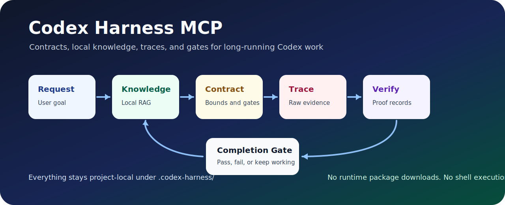

# Codex Harness MCP

Contracts, local memory, traces, eval profiles, and completion gates for Codex CLI.

`codex-harness-mcp` turns loose agent work into an auditable harness loop: define a bounded contract, query prior project knowledge, record research and implementation lessons, capture raw traces, verify evidence, compare harness profiles with eval runs, export the harness as natural-language control logic, and run a gate before saying the work is done.



## Why agents need a harness

Long-running agent work fails in boring ways: context gets compacted, research is repeated, failures are summarized too early, verification evidence disappears, and "done" gets claimed before the work is actually checked.

This MCP gives Codex a small local control plane:

- execution contracts before implementation
- project-local RAG from research and implementation lessons
- raw traces for attempts, failures, decisions, and verification
- structured verification records
- harness profiles and eval run comparisons
- natural-language harness spec export
- next-step recovery after a failure
- compact handoff context for long sessions
- explicit completion gates

The goal is not to replace Codex. The goal is to give Codex a durable working memory and a safer operating loop.

## Install

Install the skill:

```text
npx skills add chapzin/codex-harness-mcp -g -a codex -y --copy
```

Then run the bundled installer from the installed skill directory, or from this repository:

```text
node scripts/install-codex-harness-mcp.mjs
```

Verify:

```text
codex mcp list
```

Expected MCP entry:

```text
codex-harness  node  ~/.codex/mcp-servers/codex-harness-mcp/src/server.mjs
```

## Start with this prompt

```text
Use codex-harness. Bootstrap the project, migrate old harness state if needed, query local knowledge, create a small contract, record traces and lessons, record verification evidence, and run the eval gate before saying the task is done.
```

## What it adds to Codex

| Capability | What it solves |
| --- | --- |
| Contracts | Keeps work bounded with goals, permissions, budgets, outputs, and completion conditions. |
| Local knowledge RAG | Lets future sessions reuse project research and implementation lessons. |
| Raw traces | Preserves the exact failure or verification signal for recovery. |
| Verification records | Stores command output or manual checks without the MCP running shell commands. |
| Eval cases and runs | Measures harness profile changes with score, verdict, cost, token, time, and regression metadata. |
| Harness profiles | Lets Codex compare minimal, standard, verifier-heavy, research-heavy, and custom harness modes. |
| Natural-language harness spec | Exports roles, stages, adapters, state semantics, failure taxonomy, and stop rules as a portable markdown spec. |
| Next-step recovery | Helps narrow the next attempt after failure instead of thrashing. |
| Completion gates | Makes "done" an explicit evidence check, not a vibe. |
| Handoff context | Produces compact restart context after compaction or session changes. |

## Harness research alignment

The current implementation is aligned with modern harness-engineering practice around contracts, durable artifacts, trace-backed recovery, local knowledge, eval records, and explicit gates. It is intentionally a small local control plane, not a full benchmark runner or autonomous Meta-Harness optimizer.

See the detailed compatibility analysis:

- [Harness compatibility analysis - 2026-05-02](docs/harness-compatibility-analysis-2026-05-02.md)

Important operating principle: add harness structure only when it improves acceptance evidence, recovery, safety, or handoff quality. Verifiers, extra stages, and multi-candidate search are hypotheses to measure, not automatic wins.

## The harness loop

```text
User request
  -> query project knowledge
  -> create execution contract
  -> implement inside contract boundaries
  -> record traces, research, and lessons
  -> record verification evidence
  -> optionally record eval cases/runs for harness-profile changes
  -> export natural-language harness spec when sharing or porting the loop
  -> evaluate completion gate
  -> compact handoff context when needed
```

## MCP surface

Tools:

- `harness_bootstrap`
- `harness_migrate`
- `harness_create_contract`
- `harness_update_state`
- `harness_record_trace`
- `harness_record_verification`
- `harness_record_harness_profile`
- `harness_list_harness_profiles`
- `harness_record_eval_case`
- `harness_record_eval_run`
- `harness_compare_eval_runs`
- `harness_export_nl_harness`
- `harness_record_knowledge`
- `harness_record_research`
- `harness_record_lesson`
- `harness_query_knowledge`
- `harness_rebuild_knowledge_index`
- `harness_list_knowledge`
- `harness_next_step`
- `harness_eval_gate`
- `harness_compact_context`
- `harness_list`

Resources:

- `harness://state`
- `harness://contracts`
- `harness://contract/{id}`
- `harness://traces/recent`
- `harness://gates/recent`
- `harness://knowledge/index`
- `harness://knowledge/recent`
- `harness://knowledge/item/{id}`
- `harness://evals/cases`
- `harness://evals/runs`
- `harness://eval-case/{id}`
- `harness://eval-run/{id}`
- `harness://harness-profiles`
- `harness://harness-profile/{id}`
- `harness://harness/spec`

Prompts:

- `harness_bootstrap_project`
- `harness_contract_from_request`
- `harness_failure_recovery`
- `harness_verify_and_close`
- `harness_handoff_context`
- `harness_deep_research`
- `harness_learn_from_implementation`
- `harness_query_knowledge`
- `harness_record_harness_profile`
- `harness_record_eval_case`
- `harness_record_eval_run`
- `harness_compare_eval_runs`
- `harness_export_nl_harness`

## Local knowledge RAG

The knowledge store is intentionally simple and local. It writes sanitized JSON and Markdown under:

```text
.codex-harness/knowledge/
```

Use it like this:

1. Query first with `harness_query_knowledge`.
2. If the answer is missing or stale, research normally with Codex web/GitHub tools.
3. Store useful findings with `harness_record_research`.
4. After implementation, store reusable lessons with `harness_record_lesson`.
5. Future sessions retrieve that knowledge before planning.

This is not a hosted vector database. It is a dependency-free lexical retrieval layer designed to be transparent, inspectable, and safe for local agent work.

## Eval records and harness profiles

Use eval records when changing the harness itself:

1. Record the current profile with `harness_record_harness_profile`.
2. Record a task or failure as an eval case with `harness_record_eval_case`.
3. Run the eval outside the MCP.
4. Store the result with `harness_record_eval_run`.
5. Compare baseline and candidate runs with `harness_compare_eval_runs`.

This keeps the MCP safe: it stores scores, costs, token counts, traces, and regressions, but it does not execute benchmark commands or generated harness code.

## Natural-language harness spec

Use `harness_export_nl_harness` or read `harness://harness/spec` when you want the current harness logic as a portable artifact. The export includes:

- runtime charter
- roles
- stage structure
- adapters and tools
- state semantics
- failure taxonomy
- retry and stop rules
- current project snapshot

Stored project data remains inside `<untrusted-data>` blocks.

## Security model

The installer copies a local Node MCP server into `~/.codex/mcp-servers/codex-harness-mcp` and updates Codex `config.toml`.

It does not:

- download runtime packages
- start shells
- alter script execution policy
- run verification commands
- browse the internet
- call remote services
- read credentials

The server uses only Node.js built-in modules. It writes project-local state under `.codex-harness/`.

Stored user/source content is returned inside `<untrusted-data>` boundaries so the agent treats it as evidence, not instructions.

## What this is not

Not a replacement agent runtime. Not a hosted memory service. Not a command runner. Not a browser or web research tool. Not a remote telemetry layer.

It is a small local harness for Codex CLI: contracts, traces, local knowledge, verification records, eval records, harness profiles, natural-language spec export, resources, prompts, and gates.

## Development checks

Run all tests:

```text
Get-ChildItem .\tests -Filter *.mjs | Sort-Object Name | ForEach-Object { node $_.FullName; if ($LASTEXITCODE -ne 0) { exit $LASTEXITCODE } }
```

Key guardrails:

- no runtime dependency downloads
- no installer command execution markers
- prompt-injection boundaries enforced
- resources and prompts exposed safely
- persistent knowledge RAG queryable locally
- eval/profile records persist without command execution
- natural-language harness spec export remains prompt-injection bounded
